<p align="center">
    <span>
        
    </span>
</p>
<h1 align="center" style="margin: 30px 0 30px; font-weight: bold;">记账APP (v1.0.0)</h1>
<h4 align="center">基于SpringBoot+Vue3前后端分离的Java快速开发框架</h4>
<p align="center">
	
</p>

# 引言

随着现代生活节奏的加快和消费模式的多样化，个人理财和账目管理已成为每个人日常生活中不可或缺的一部分。为了高效、便捷地管理日常账务，我们开发了一款基于RuoYi-App、SpringBoot、VUE3和TypeScript技术栈的记账应用。该记账APP不仅提供简洁的财务记录和分析功能，还特别加入了导入账单的便捷功能，支持通过微信、支付宝等平台导入账单，用户可以轻松上传CSC、ZIP格式的账单文件，快速同步各类支付记录，极大提升了用户的使用体验。

在本项目中，RuoYi-App作为系统的基础框架，提供了稳定的权限管理和快速开发的能力，确保了应用的高效开发和稳定运行。后端采用了SpringBoot技术栈，具备高度的可扩展性和强大的API支持，能够支持大规模的数据处理和灵活的功能拓展。前端则采用了VUE3和TypeScript，通过现代化的前端开发模式，提供了优雅的用户交互和流畅的操作体验。

本记账APP旨在简化财务管理流程，使用户能够轻松记录、分类和分析支出，帮助他们更好地掌握自己的财务状况，从而做出更加理智和科学的财务决策。


1. 使用 UniApp+Vue3 的最新框架
2. 支持 TS、SCSS、LESS 等对 js 和 css 的扩充语言
3. 使用 Pinia 代替 Vuex，更加轻巧简单
4. 使用 uView-Plus（好看的 ui） 代替 uView-ui 的 ui 组件库
5. 使用 uCharts（方便的图表）画图工具
6. 已经完成了分包操作
7. 将原有内置工具进行类型标定
8. 分别提供了 uview-plus 和 ucharts 的模板（可以直接使用或者用于学习）

# 快速开始

**注意：** node 版本需要 16+

## 安装
**_Vue3/Vite 版要求 node 版本^14.18.0 || >=16.0.0_**

```shell
npm install
cnpm install
yarn
pnpm install
```

# 启动

1. 将项目下载到本地
2. 初始化项目---进入项目根路径运行指令初始化项目
   `npm install`
3. 运行项目---进入项目根路径运行指令（在 package.json 能找到所有指令）：
   以微信小程序为例：`npm run dev:mp-weixin`
   以 H5 为例 ` npm run dev:h5`
4. 查看项目 以微信小程序为例：
   打开微信开发者工具，导入项目路径 dist\dev\mp-weixin
   以 H5 为例：打开浏览器，输入控制台输出的地址
   注：公众号属于 H5，以微信公众号为例，打开微信开发者工具，输入控制台输出的地址
5. 打包项目---进入项目根路径运行指令（在 package.json 能找到所有指令）：
   以微信小程序为例：`npm run build:mp-weixin`
   以 H5 为例： `npm run build:h5`


# 内置组件

1. App自动更新组件
2. 计算器组件
3. 日历组件
4. 报表统计组件


# 功能演示

<table>
    <tr>
        <td>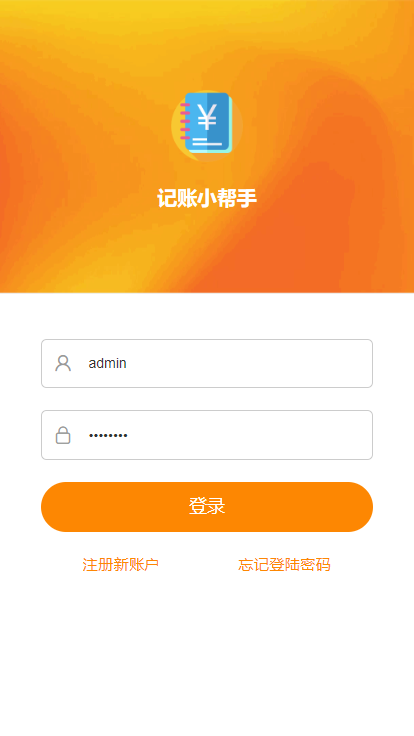</td>
        <td>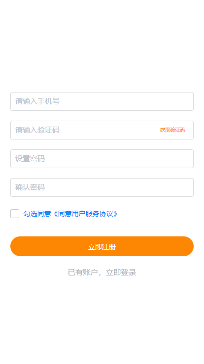</td>
        <td>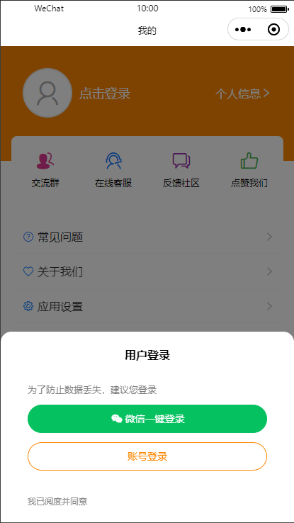</td>
        <td>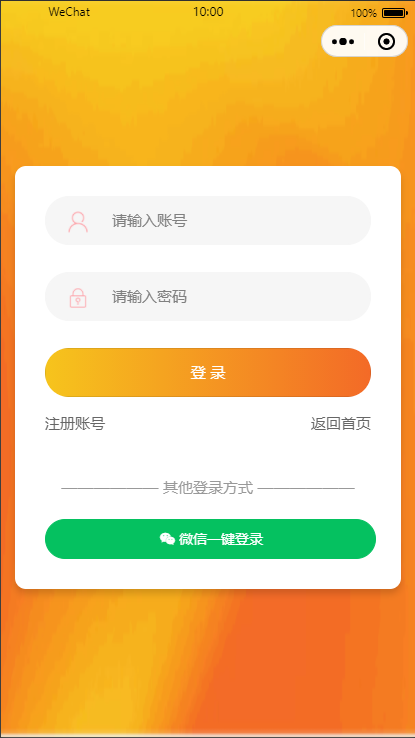</td>
    </tr>
    <tr>
        <td>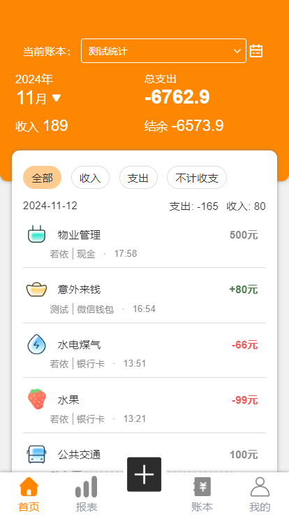</td>
        <td>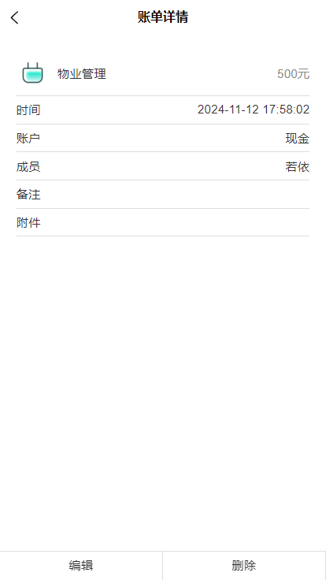</td>
        <td>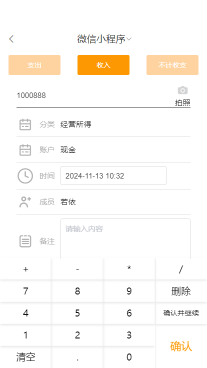</td>
        <td>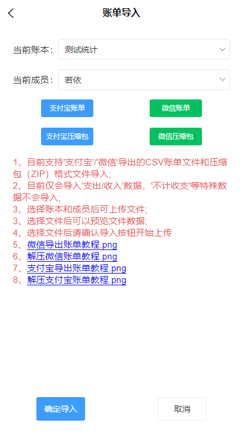</td>
    </tr>
    <tr>
        <td>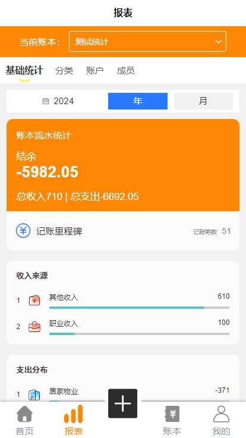</td>
        <td>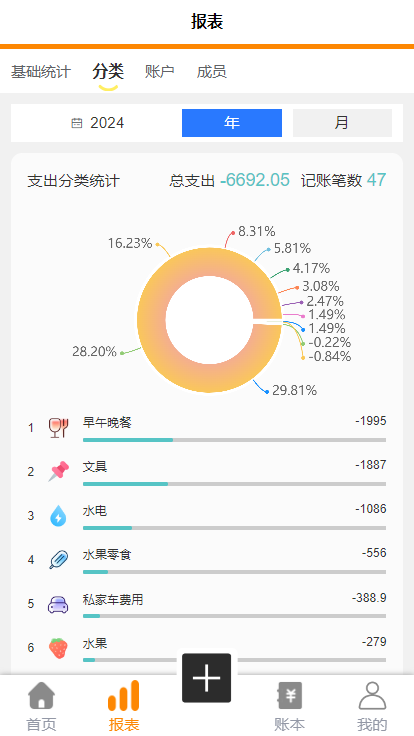</td>
        <td>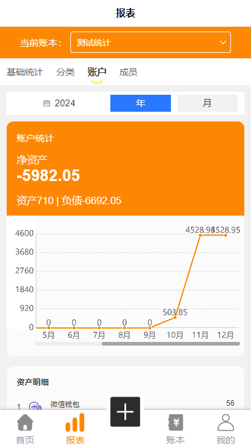</td>
        <td>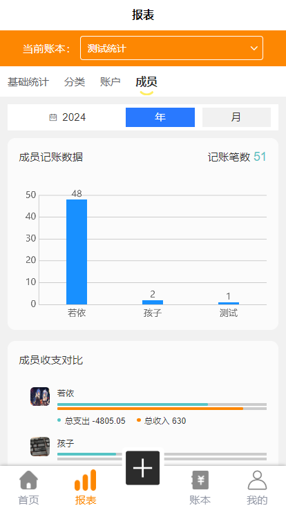</td>
    </tr>
    <tr>
       <td>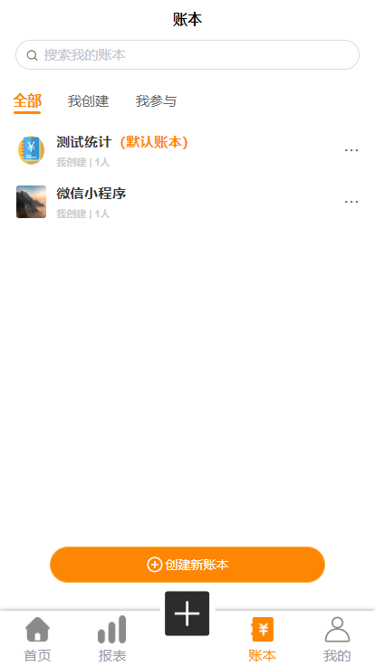</td>
       <td>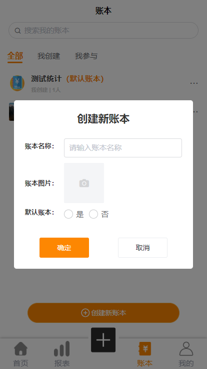</td>
       <td>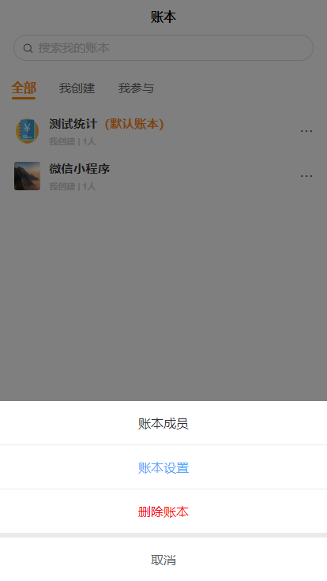</td>
       <td>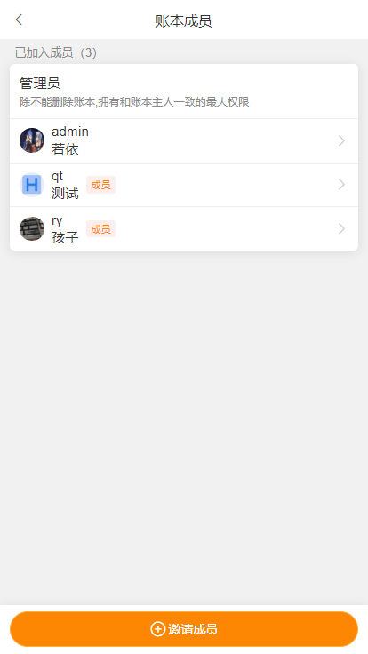</td>
       <td>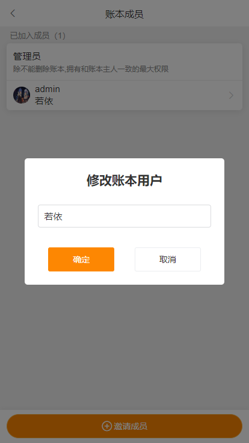</td>
    </tr>
    <tr>
       <td>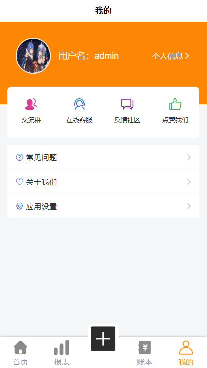</td>
       <td>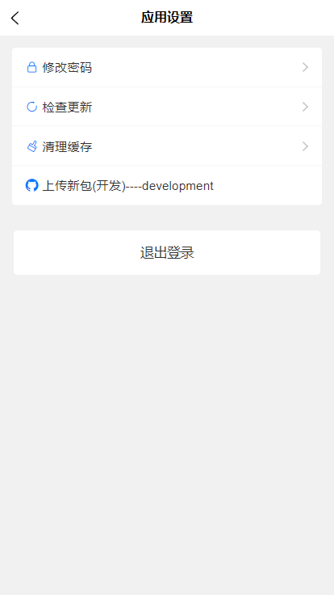</td>
    </tr>
</table>
# 附录application setting

[Vue3 官网](https://cn.vuejs.org/)；
[uniapp 官网](https://uniapp.dcloud.net.cn/)；
[uView-plus 官网](https://uiadmin.net/uview-plus/)；
[uCharts 官网](https://www.ucharts.cn/v2/#/)；
[RuoYi 官网](http://ruoyi.vip/)；
